# Architecture

> Auto-generated from the GitNexus knowledge graph (1661 symbols, 4435 relationships, 36 execution flows).

## Overview

TCKDB is a Thermochemical and Kinetics Database that stores computational chemistry data. The system ingests scientific payloads (species, reactions, kinetics, thermodynamics, conformers, networks), resolves identity and provenance, deduplicates entities, and persists them into a PostgreSQL database with RDKit chemical structure support.

The architecture follows a **layered pipeline** pattern: upload schemas validate and normalize input, workflows orchestrate multi-step persistence, services and resolution helpers handle deduplication and entity lookup, and ORM models define the database schema.

## Architecture Diagram

```mermaid
graph TB
    subgraph Entry["Entry Points"]
        API["API Routes<br/><i>app/resources/</i><br/>(planned)"]
        Scripts["Prototype Scripts<br/><i>scripts/</i>"]
    end

    subgraph Validation["Validation & Normalization"]
        UploadSchemas["Upload Schemas<br/><i>app/schemas/workflows/</i><br/>kinetics, reaction, conformer,<br/>network_pdep, literature"]
        EntitySchemas["Entity Schemas<br/><i>app/schemas/entities/</i><br/>Create / Read / Update"]
        Fragments["Reusable Fragments<br/><i>app/schemas/fragments/</i><br/>identity, calculation"]
        SchemaUtils["Schema Utilities<br/><i>app/schemas/utils.py</i><br/>ORCID, text normalization"]
    end

    subgraph Orchestration["Workflow Orchestration"]
        WfReaction["persist_reaction_upload<br/><i>app/workflows/reaction.py</i>"]
        WfKinetics["persist_kinetics_upload<br/><i>app/workflows/kinetics.py</i>"]
        WfNetwork["persist_network_upload<br/><i>app/workflows/network.py</i>"]
        WfNetPdep["persist_network_pdep_upload<br/><i>app/workflows/network_pdep.py</i>"]
        WfConformer["persist_conformer_upload<br/><i>app/workflows/conformer.py</i>"]
    end

    subgraph BusinessLogic["Services & Resolution"]
        SvcLitRes["Literature Resolution<br/><i>app/services/literature_resolution.py</i>"]
        SvcLitMeta["Literature Metadata<br/><i>app/services/literature_metadata.py</i><br/>DOI / ISBN fetch"]
        SvcSoftware["Software Resolution<br/><i>app/services/software_resolution.py</i>"]
        SvcCalc["Calculation Resolution<br/><i>app/services/calculation_resolution.py</i>"]
        SvcKinetics["Kinetics Resolution<br/><i>app/services/kinetics_resolution.py</i>"]
        SvcNetwork["Network Resolution<br/><i>app/services/network_resolution.py</i>"]
        SvcStatmech["StatMech Resolution<br/><i>app/services/statmech_resolution.py</i>"]
        ResSpecies["Species Resolution<br/><i>app/resolution/species.py</i>"]
        ResReaction["Reaction Resolution<br/><i>app/resolution/reaction.py</i>"]
        ResGeometry["Geometry Resolution<br/><i>app/resolution/geometry.py</i>"]
    end

    subgraph Domain["Chemistry Domain"]
        ChemSpecies["Species Identity<br/><i>app/chemistry/species.py</i><br/>SMILES, charge, multiplicity"]
        ChemGeometry["Geometry Parsing<br/><i>app/chemistry/geometry.py</i><br/>XYZ parsing"]
        RxnFamily["Reaction Families<br/><i>app/schemas/reaction_family.py</i><br/>canonical lookup"]
    end

    subgraph Data["Data Layer"]
        Models["ORM Models<br/><i>app/db/models/</i><br/>67 symbols across 15+ tables"]
        RDKit["RDKit Mol Type<br/><i>app/db/types.py</i>"]
        Base["Base & Naming<br/><i>app/db/base.py</i>"]
        Alembic["Migrations<br/><i>alembic/</i>"]
    end

    subgraph Infra["Infrastructure"]
        PG[("PostgreSQL<br/>+ RDKit Cartridge")]
    end

    %% Entry → Validation
    API --> UploadSchemas
    Scripts --> Models

    %% Validation internal
    UploadSchemas --> Fragments
    UploadSchemas --> SchemaUtils
    EntitySchemas --> SchemaUtils

    %% Validation → Orchestration
    UploadSchemas --> WfReaction
    UploadSchemas --> WfKinetics
    UploadSchemas --> WfNetwork
    UploadSchemas --> WfNetPdep
    UploadSchemas --> WfConformer

    %% Orchestration → Services
    WfReaction --> ResReaction
    WfReaction --> SvcLitRes
    WfKinetics --> SvcKinetics
    WfKinetics --> SvcLitRes
    WfNetwork --> SvcNetwork
    WfNetwork --> SvcLitRes
    WfNetPdep --> SvcLitRes
    WfNetPdep --> SvcCalc
    WfNetPdep --> ResGeometry
    WfConformer --> ResGeometry
    WfConformer --> SvcCalc

    %% Services internal
    SvcLitRes --> SvcLitMeta
    SvcKinetics --> SvcLitRes
    SvcNetwork --> SvcLitRes
    ResReaction --> RxnFamily
    ResReaction --> ResSpecies

    %% Services → Domain
    ResSpecies --> ChemSpecies
    ResGeometry --> ChemGeometry

    %% Services → Data
    SvcLitRes --> Models
    SvcSoftware --> Models
    SvcCalc --> Models
    ResSpecies --> Models
    ResReaction --> Models
    ResGeometry --> Models

    %% Data internal
    Models --> Base
    Models --> RDKit
    Alembic --> Base
    Base --> PG
    Alembic --> PG

    %% Styling
    classDef entryStyle fill:#4a9eff,color:#fff,stroke:#2a7edf
    classDef validStyle fill:#f5a623,color:#fff,stroke:#d48b1a
    classDef orchStyle fill:#7b68ee,color:#fff,stroke:#5b48ce
    classDef svcStyle fill:#50c878,color:#fff,stroke:#30a858
    classDef domainStyle fill:#ff6b6b,color:#fff,stroke:#df4b4b
    classDef dataStyle fill:#808080,color:#fff,stroke:#606060
    classDef infraStyle fill:#2c3e50,color:#fff,stroke:#1a252f

    class API,Scripts entryStyle
    class UploadSchemas,EntitySchemas,Fragments,SchemaUtils validStyle
    class WfReaction,WfKinetics,WfNetwork,WfNetPdep,WfConformer orchStyle
    class SvcLitRes,SvcLitMeta,SvcSoftware,SvcCalc,SvcKinetics,SvcNetwork,SvcStatmech,ResSpecies,ResReaction,ResGeometry svcStyle
    class ChemSpecies,ChemGeometry,RxnFamily domainStyle
    class Models,RDKit,Base,Alembic dataStyle
    class PG infraStyle
```



## Functional Areas

| Area | Symbols | Cohesion | Description |
|------|---------|----------|-------------|
| **Entities** | 208 | 81% | Pydantic schemas — Create/Read/Update for every domain entity, plus upload payloads and reusable fragments |
| **Models** | 67 | 58% | SQLAlchemy ORM table definitions across species, reactions, calculations, kinetics, thermo, transport, networks, and provenance |
| **Tests** | 42 | 88% | Integration tests with auto-created test DB, transaction rollback, and migration application |
| **Services** | 31 | 88% | Business logic: literature metadata fetch, software/calculation/kinetics/network resolution and deduplication |
| **Scripts** | 31 | 91% | CLI prototypes: reaction bundle import, migration sync checker |
| **Workflows** | 23 | 98% | Multi-step persist orchestrators for each upload type (reaction, kinetics, conformer, network, network_pdep) |
| **Schemas** | 21 | 95% | Shared validation and normalization: ORCID validation, text normalization, SMILES canonicalization, reaction family lookup |
| **Chemistry** | 7 | 100% | Pure chemistry functions: species identity from SMILES, formal charge, spin multiplicity, XYZ geometry parsing |

## Key Execution Flows

### 1. Network PDep Upload Pipeline
```
persist_network_pdep_upload (workflow)
  → resolve_or_create_literature (service)
    → resolve_literature_submission (service)
      → fetch_doi_metadata (service)
        → normalize_doi (service)
```
Orchestrates the most complex upload type: pressure-dependent networks with channels, states, bath gases, and PLOG kinetics. Resolves literature references by fetching metadata from DOI/ISBN and deduplicating against existing records.

### 2. Kinetics Upload Pipeline
```
resolve_kinetics_upload (service)
  → resolve_or_create_literature (service)
    → resolve_literature_submission (service)
      → fetch_doi_metadata (service)
        → normalize_doi (service)
```
Resolves kinetics data with literature provenance. Shares the literature resolution pathway with all other upload types.

### 3. Conformer Upload Pipeline
```
persist_conformer_upload (workflow)
  → resolve_geometry_payload (resolution)
    → geometry_create_from_payload (resolution)
      → parse_xyz (chemistry)
```
Persists conformer observations with their associated geometries. XYZ coordinate strings are parsed and validated by the chemistry layer.

### 4. Species Entry Resolution
```
resolve_species_entry (resolution)
  → resolve_species (resolution)
    → canonical_species_identity (chemistry)
      → identity_mol_from_smiles (chemistry)
```
Resolves species identity by canonicalizing SMILES strings through RDKit, computing formal charge and spin multiplicity, and deduplicating against existing species records.

### 5. Reaction Resolution
```
resolve_chem_reaction (resolution)
  → resolve_reaction_family (resolution)
    → find_canonical_reaction_family (schema)
      → _reaction_family_key (schema)
```
Resolves chemical reactions by looking up their reaction family from a canonical registry (e.g., "H_Abstraction", "R_Addition_MultipleBond") and linking participant species.

### 6. Software Resolution
```
resolve_software_release (service)
  → resolve_software (service)
    → normalize_software_name (service)
      → normalize_required_text (schema utility)
```
Deduplicates software and software releases by normalizing names (case, whitespace) before lookup.

### 7. Test Database Setup
```
db_engine (conftest fixture)
  → _recreate_test_database
    → _database_url
      → _db_env
        → _base_env
```
Each test session creates a fresh `tckdb_test` database, applies all Alembic migrations, and provides a transactional session that rolls back after each test.

## Design Principles

- **Three-layer resolution**: Upload schema (validate) → Workflow (orchestrate) → Resolution/Service (deduplicate & persist)
- **No FK IDs in upload schemas**: Users submit scientific content; FK resolution happens in services
- **Separation of concerns**: Identity (what) vs Result (computed) vs Provenance (how) vs Curation (review)
- **Shared resolution pathways**: Literature, software, and calculation resolution are reused across all upload types
- **Chemistry as pure functions**: Species identity, charge, multiplicity, and geometry parsing are stateless utilities with no database coupling

## Entity Groups

| Group | Key Tables | Purpose |
|-------|-----------|---------|
| **Identity** | `species`, `species_entry`, `chem_reaction`, `reaction_entry`, `transition_state`, `transition_state_entry` | What something is |
| **Calculations** | `calculation`, `calc_sp_result`, `calc_opt_result`, `calc_freq_result`, `calc_scan_result` | Computed results |
| **Conformers** | `conformer_group`, `conformer_observation`, `conformer_assignment_scheme`, `conformer_selection` | Molecular conformations |
| **Scientific Products** | `statmech`, `thermo`, `kinetics`, `transport`, `network` | Derived properties |
| **Provenance** | `software`, `software_release`, `workflow_tool`, `level_of_theory`, `literature`, `author` | How it was produced |
